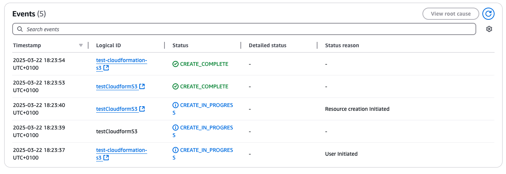

# AWS CLI & CloudFormation & Terraform

Vamos a desplegar un S3 Bucket, con las politicas por defecto, utilizando las 3 herramientas disponibles.

## AWS CLI
Partimos de la imagen docker que tenemos en este repo

1º Dentro de la imagen docker, lo primero es autenticarnos en el aws-cli. (Para ello necesitamos tener generadas las Access-Keys de nuestra cuenta)

Vamos a autenticar con variables de entorno, dentro del docker ejecutamos:
```
export AWS_ACCESS_KEY_ID=AWS_ACCESS_KEY_ID
export AWS_SECRET_ACCESS_KEY=AWS_SECRET_ACCESS_KEY
export AWS_DEFAULT_REGION=eu-west-1
```
Información sobre la cuenta de que estamos usando
```
aws sts get-caller-identity
```

*arn: https://docs.aws.amazon.com/es_es/IAM/latest/UserGuide/reference-arns.html

Creacion de un s3 bucket
```
aws s3 mb s3://test-cli
```
Listamos, creamos un fichero y lo subimos
```
aws s3 ls
touch fichero_prueba.txt
aws s3 cp
aws s3 cp fichero_prueba.txt s3://test-cli
```

## AWS Cloudformation
Plantilla en formamo yaml para la creacion de s3 bucket. La guardamos como fichero en local.

```
AWSTemplateFormatVersion: '2010-09-09'
Description: Plantilla para crear un Bucket

Resources:
  testCloudformS3:
    Type: 'AWS::S3::Bucket'
    Properties:
      BucketName: 'testcloudbucket220325'  #Nombre sea único
      AccessControl: 'Private'  #PublicRead, PublicReadWrite, AuthenticatedRead
      VersioningConfiguration:
        Status: 'Enabled'

Outputs:
  BucketName:
    Description: 'Nombre del bucket S3 creado'
    Value: !Ref testCloudformS3
  BucketURL:
    Description: 'URL del bucket S3'
    Value: !Sub 'https://s3.amazonaws.com/${testCloudformS3}'

```

Accedemos al servicio de CloudFormation. ***Veremos como crea un bucket para las templates***

https://eu-west-1.console.aws.amazon.com/cloudformation/home?region=eu-west-1#/stacks?filteringText=&filteringStatus=active&viewNested=true



**Github con plantillas de AWS CloudFormation**
https://github.com/aws-cloudformation/aws-cloudformation-templates


**Probar el Infrasctructure Composer** Cuando se sube una plantilla, es capaz de representar componentes y dependendcias.


## Terraform

https://registry.terraform.io/providers/hashicorp/aws/latest/docs

Dentro de la carpeta terraform, vamos a encontrar el fichero main.tf.
https://registry.terraform.io/providers/hashicorp/aws/latest/docs/resources/s3_bucket


Tenemos que ejecutar los siguientes export, si no los hemos ejecutado antes.
```
export AWS_ACCESS_KEY_ID=AWS_ACCESS_KEY_ID
export AWS_SECRET_ACCESS_KEY=AWS_SECRET_ACCESS_KEY
export AWS_DEFAULT_REGION=eu-west-1
```
A la altura del fichero main.tf
Descarta de dependencias y plugins
```
terraform init
```
***Listar carpeta ocultas creadas .terraform**

Resumen de los cambios que va a ejecutar
```
terraform plan -out plan.out
```
Aplicamos el plan que hemos visto previamente
```
terraform apply plan.out
```

***Echar un ojo al tfstate**


Para destruir lo que hemos construido
```
terraform destroy
```
