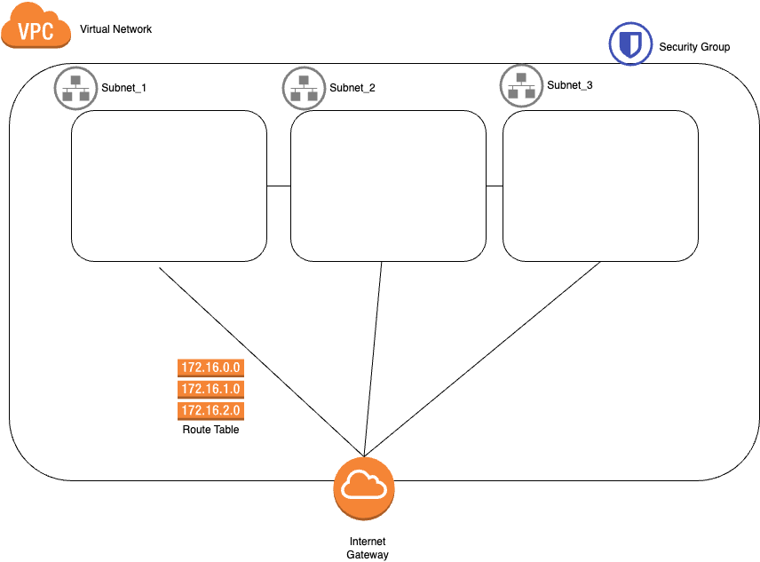
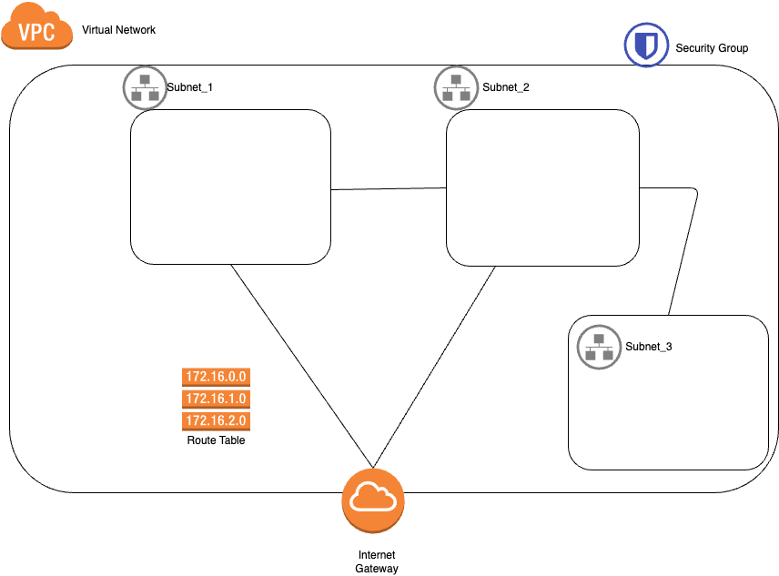

# Terraform code





* Virtual Network:
  * Espacio de direcciones: 10.0.0.0/16
* Subnets:
  * Espacios de direcciones: 10.0.1.0/24
  * Espacios de direcciones: 10.0.2.0/24
  * Espacios de direcciones: 10.0.2.0/24

A la altura del fichero main.tf
Descarta de dependencias y plugins
```
terraform init
```
Resumen de los cambios que va a ejecutar
```
terraform plan -out plan.out
```
Aplicamos el plan que hemos visto previamente
```
terraform apply plan.out
```

Echar un ojo al tfstate.


Para destruir lo que hemos construido
```
terraform destroy
```
Revisamos las listas en address_spaces y los tags.
