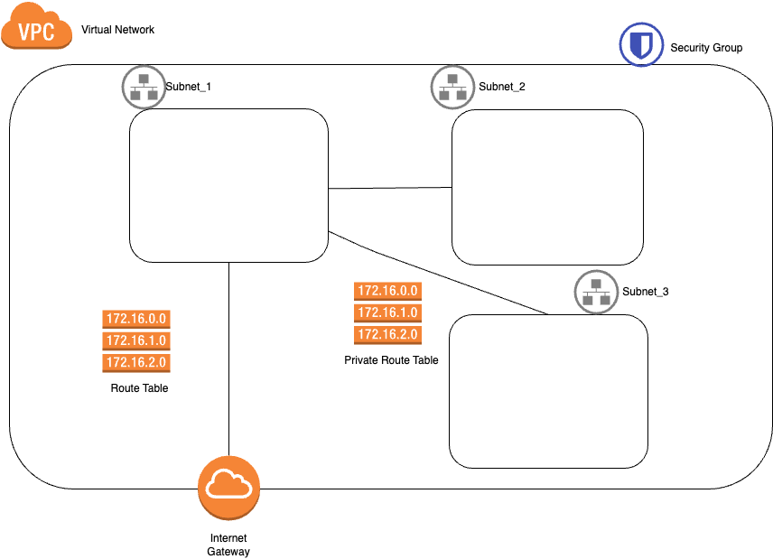

# Terraform code



* Virtual Network:
  * Espacio de direcciones: 10.0.0.0/16
* Subnets:
  * Espacios de direcciones: 10.0.1.0/24
  * Espacios de direcciones: 10.0.2.0/24
  * Espacios de direcciones: 10.0.2.0/24

A la altura del fichero main.tf
Descarga de dependencias y plugins
```
terraform init
```
Resumen de los cambios que va a ejecutar
```
terraform plan -out plan.out
```
Aplicamos el plan que hemos visto previamente
```
terraform apply plan.out
```

Echar un ojo al tfstate.


# Terraform apply target
```
terraform apply -target module.subnet1
Depedencias --> s(Si no tiene la VPC creada, la creara)
```
