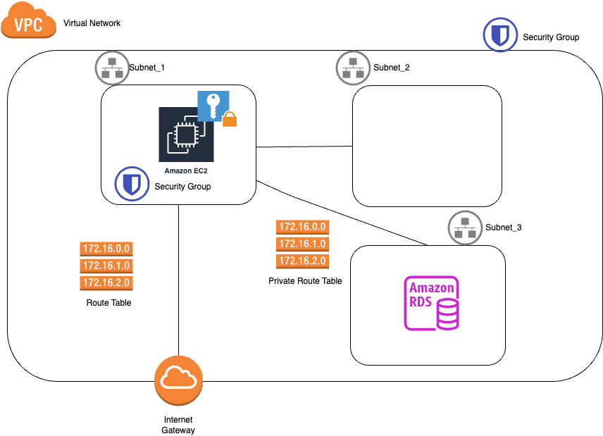

# Terraform code



* EC2 - Virtual machine en la subnet_2 (public subnet). ***Crear clave publica/privada para autenticar**
* RDS - Montar DB de tipo MariaDB en la vnet aislada (private subnet)

* Virtual Network:
  * Espacio de direcciones: 10.0.0.0/16
* Subnets:
  * Espacios de direcciones: 10.0.1.0/24
  * Espacios de direcciones: 10.0.2.0/24
  * Espacios de direcciones: 10.0.2.0/24

## Creación de clave publico/privada para autenticar en EC2 (AWS-CLI)
> Reference: https://github.com/rodvic/cloud-django/blob/master/aws/README.md#create-a-key-pair

```
aws ec2 create-key-pair --key-name proupsa-ec2-key-pair --query 'KeyMaterial' --output text > proupsa-ec2-key-pair.pem
```

## Terraform
A la altura del fichero main.tf
Descarga de dependencias y plugins
```
terraform init
```
Resumen de los cambios que va a ejecutar
```
terraform plan -out plan.out
```
Aplicamos el plan que hemos visto previamente
```
terraform apply plan.out
```
Echar un ojo al tfstate.

## Instalación cliente mysql para conectar a RDS
Una vez conectado a la EC2
```
sudo dnf update
sudo dnf install mariadb105
```

## Conexión RDS (desde máquina EC2)
```
mysql -h xxxxxxxxx.eu-west-1.rds.amazonaws.com -u xxxxxx -p
```
