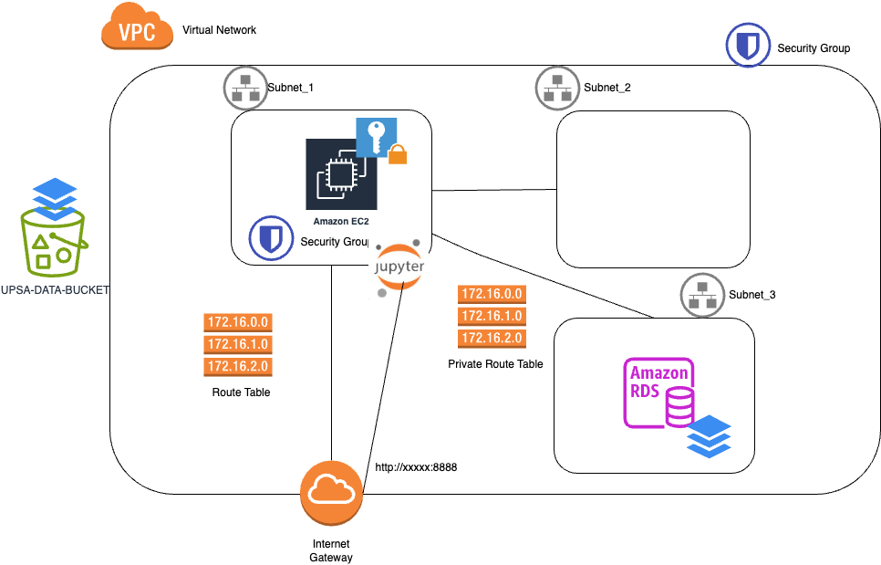

# Terraform code



Sobre la infra creada en la práctica anterior vamos a montar.
* S3 Bucket de datos
* Dentro de la EC2:
  * Virtualenv
  * Jupyter Lab
  * pyspark
  * mysql

Nos conectaremos mediante el puerto 8888 al jupyterlab para poder ejecutar dos notebooks
* Database_model --> Creación y carga de tablas con datos en la MySQL
* Algorithm --> Algoritmo en pyspark

## Algorithm
Algoritmo en pyspark que se conecta a la base de datos para recuperar el dataset1, tambien conecta con el s3 para obtener el dataset2 y realiza una operacion de join por campos comunes para generar un único dataset conjunto.

## Subir datos a bucket (tambien se puede conectar con práctica_lambda_function)
Tras aplicar el terraform para crear el bucket de datos
```
aws s3 cp files_notebooks/dataset2.csv s3://XXXXXXX-bucket/
```

## Subir carpeta notebooks a EC2
```
scp -r -i "" ./files_notebooks/notebooks ubuntu@xxxx:~/notebooks
```

## Ejecución dentro de la EC2
```
#Creacion de un Virtualenv de python
virtualenv test_jupyter
source test_jupyter/bin/activate

#Instalacion de librerias con pip3 del virtualenv
pip3 install jupyterlab
pip3 install pyspark==3.3.2
pip3 install mysql-connector-python
pip3 install boto3
```

Ejecutamos el siguiente comando que arranca el Jupyter Lab en el puerto 8888 (previamente hemos habilitado la regla en el Security Group)
```
#Autenticacion del S3 SDK
export AWS_ACCESS_KEY_ID=XXXXX
export AWS_SECRET_ACCESS_KEY=XXXXXX
export AWS_DEFAULT_REGION=eu-west-1

#Conexion con mysql con JDBC
export PYSPARK_SUBMIT_ARGS="--jars /home/ubuntu/notebooks/mysql-connector-j-8.0.31.jar pyspark-shell"

jupyter lab --port 8888 --ip 0.0.0.0
```

Nos devuelve una url del tipo...

> http://127.0.0.1:8888/lab?token=49fbaf086c62ecc0d8955f3a4d4XXXXXXXXX

Cambiamos el 127.0.0.1 por la ip pública de la máquica EC2

## Terraform
A la altura del fichero main.tf
Descarga de dependencias y plugins
```
terraform init
```
Resumen de los cambios que va a ejecutar
```
terraform plan -out plan.out
```
Aplicamos el plan que hemos visto previamente
```
terraform apply plan.out
```
Echar un ojo al tfstate.
