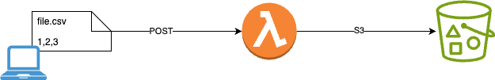

# Lambda Functions
Infra que vamos a crear
* Lambda Function
* S3 Bucket (podemos usar alguno de los ya creados)

Vamos a crear una lambda funcion en python que recibira un fichero csv mediante una petición POST, lo procesara, y lo dejara en un S3 Bucket.

## Creación de Lambda function
Vamos a realizar desde el portal, también se puede hacer con terraform
> https://registry.terraform.io/providers/hashicorp/aws/latest/docs/resources/lambda_function

1. Necesitamos crear un ROLE específico para que la función pueda autenticar en el bucket

    * Usuario --> Security Credentials
    * Access Management --> Roles
    * Create Role
        * AWS Service
        * Use case --> Lambda
        * AmazonS3FullAccess (permissions policies)
        * RoleName: Lamba_function_s3_role


2. Config lambda function
    * Runtime: python 3.13
    * Architecture: x86_64
    * Permissions --> Use existing role --> Lamba_function_s3_role (Role creado del paso anterior)
    * Additional Configurations
        * Enable Function URL
        * Auth Type NONE

3. Copiamos el código de la lambda function
    * files/lambda_function.py

4. Deploy (Desplegar el nuevo código)

5. Lanzar un fichero desde local
```
cat dataset2.csv | base64 | curl -X POST URL_LAMBDA_FUNCTION \
     -H "Content-Type: text/plain" --data @-
```
