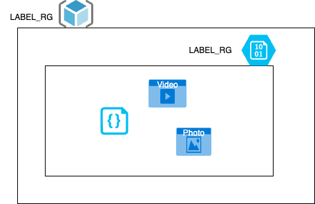

# AZ-Cli & ARM Templates & Terraform


Vamos a desplegar los siguientes componentes utilizando:


## Az-cli
1º Nos bajamos la imagen docker
2º Autenticamos con credenciales

```
az login --use-device-code
```
*Esto nos dara un código y una url, al abrir la URL tendremos que autenticarnos con nuestra cuenta de azure.
Una vez autenticados, podemos ver que subscripción tenemos activa ejecutando
```
az account list -o table
```

### Creación de componentes
1º Vamos a crear el Resource Group (RG)
```
az group create --name <nombre-del-grupo> --location westeurope
```

2º Vamos a crear la Storage account

```
az storage account create --name <nombre-de-la-cuenta> --resource-group <nombre-del-grupo-de-recursos> -l westeurope --sku Standard_LRS --kind BlobStorage --access-tier hot

```
sku: Tipo de redundancia que queremos
* Standard_LRS
* Standard_GRS
* Standard_ZRS
* ...

Kind: Tipo de cuenta
* BlobStorage
* StorageV2
* FileStorage
* ...

Access tier: Nivel de acceso a los datos
* Hot: Para acceso a datos con frecuencia
* Cold: Datos que se acceden con poca frecuencia
* ...
## ARM Templates
Las plantillas ARM se pueden desplegar utilizando el portal web, azcli, powershell...
## Az cli
La plantilla puede estar en local o en remoto.
```
az deployment group create \
  --name testarmtemplate \
  --resource-group testaz \
  --template-uri "https://raw.githubusercontent.com/Azure/azure-quickstart-templates/master/quickstarts/microsoft.storage/storage-account-create/azuredeploy.json" \
  --parameters storageAccountType=Standard_LRS
  ```
Repo GIT con plantillas de azure:
https://github.com/Azure/azure-quickstart-templates/tree/master/quickstarts/microsoft.storage/storage-account-create

## Portal WEB
Utilizamos el recurso Template Specs.

## Terraform

Dentro de la carpeta terraform, vamos a encontrar el fichero main.tf.
https://registry.terraform.io/providers/hashicorp/azurerm/latest/docs/resources/resource_group
https://registry.terraform.io/providers/hashicorp/azurerm/latest/docs/resources/storage_account


Tenemos que ejecutar los siguientes export porque los utiliza el provider de azure.
```
az account list -o table
export ARM_TENANT_ID="tenant"
export ARM_SUBSCRIPTION_ID="Subscription ID which can be found in the Azure portal"
```
A la altura del fichero main.tf
Descarta de dependencias y plugins
```
terraform init
```
Resumen de los cambios que va a ejecutar
```
terraform plan -out plan.out
```
Aplicamos el plan que hemos visto previamente
```
terraform apply plan.out
```

Echar un ojo al tfstate.


Para destruir lo que hemos construido
```
terraform destroy
```
