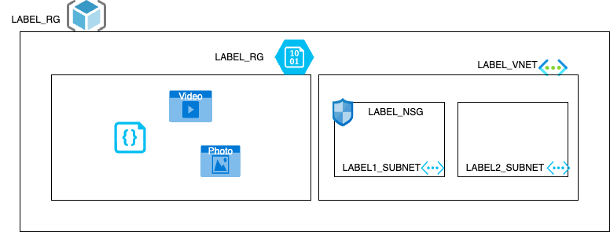

# AZ-Cli & ARM Templates & Terraform


Vamos a desplegar la infra de los dos ejercicios anteriores pero esta vez organizada en módulos y variables.

* Virtual Network:
  * Espacio de direcciones: 10.0.0.0/16
* Subnets:
  * Espacios de direcciones: 10.0.1.0/24
  * Espacios de direcciones: 10.0.2.0/24
* Network security group
  * Conectado a una de las subnets


## Terraform

Dentro de la carpeta terraform, vamos a encontrar el fichero main.tf.
https://registry.terraform.io/providers/hashicorp/azurerm/3.117.0/docs/resources/resource_group
https://registry.terraform.io/providers/hashicorp/azurerm/3.117.0/docs/resources/storage_account


Tenemos que ejecutar los siguientes export porque los utiliza el provider de azure.
```
az account list -o table
export ARM_TENANT_ID="tenant"
export ARM_SUBSCRIPTION_ID="Subscription ID which can be found in the Azure portal"
```
A la altura del fichero main.tf
Descarta de dependencias y plugins
```
terraform init
```
Resumen de los cambios que va a ejecutar
```
terraform plan -out plan.out
```
Aplicamos el plan que hemos visto previamente
```
terraform apply plan.out
```

Echar un ojo al tfstate.


Para destruir lo que hemos construido
```
terraform destroy
```
Revisamos las listas en address_spaces y los tags.
