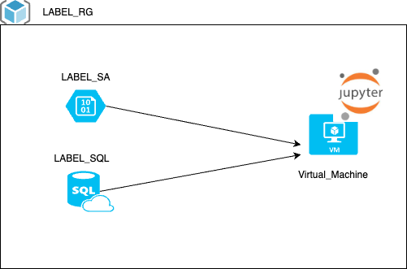

En esta práctica vamos a desplegar la siguiente infraestructura




Vamos a desplegar un Stogare account y una Base de datos SQL.
En ambos vamos a cargar 2 datasets
Los leeremos con un Notebook de pyspark dentro de la VM sobre la que vamos a instalar Jupyter Notebook y mostraremos la salida de una operación.

!!IMPORTANTE - Mirar las zonas disponibles de la mysql
* az mysql flexible-server list-skus --location westeurope
* PORTAL

Tenemos que ejecutar los siguientes export porque los utiliza el provider de azure.
```
az account list -o table
export ARM_TENANT_ID="tenant"
export ARM_SUBSCRIPTION_ID="Subscription ID which can be found in the Azure portal"
```
A la altura del fichero main.tf
Descarta de dependencias y plugins
```
terraform init
```
Resumen de los cambios que va a ejecutar
```
terraform plan -out plan.out
```
Aplicamos el plan que hemos visto previamente
```
terraform apply plan.out
```

Para destruir lo que hemos construido
```
terraform destroy
```
Revisamos nuevos RG creados.

```
#Scrip instalación en VM (Se instala en el arranque como init_script)
sudo apt install python3-virtualenv
sudo apt install -y openjdk-8-jdk
sudo apt install -y mysql-client
```
```
#Creacion de un Virtualenv de python
virtualenv test_jupyter
source test_jupyter/bin/activate

#Instalacion de librerias con pip3 del virtualenv
pip3 install jupyterlab
pip3 install pyspark==3.3.2
pip3 install mysql-connector-python
pip install azure-storage-blob
```

## Pasos previos a la práctica desde el portal

1. Dentro del storage, creamos un container y subimos el fichero files/dataset2.csv
2. Dentro de la VM, subimos los ficheros de files/* a /home/adminuser/notebooks (scp -o PubkeyAuthentication=no * XXXXX@XXXXXXX:/home//notebooks/)


Ejecutamos el siguiente comando para el arranque del JupyterNotebook

```
#Conexion con mysql con JDBC
export PYSPARK_SUBMIT_ARGS="--jars /home/adminuser/notebooks/mysql-connector-j-8.0.31.jar pyspark-shell"

jupyter lab --port 8888 --ip 0.0.0.0

#Abrir puerto NSG
```

Ejecutamos los playbooks:
* Algorithm --> Rellena la base de datos
* Database_model --> Lee de dos entidades y hace un join
