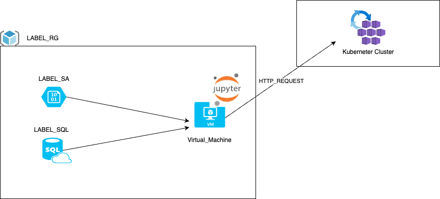

En esta práctica vamos a desplegar la siguiente infraestructura


Sobre la práctica anterior, vamos añadir una api, dentro de un contenedor, a la que podemos enviar los resultados y visualizarlos en el log.

Tenemos que ejecutar los siguientes export porque los utiliza el provider de azure.
```
az account list -o table
export ARM_TENANT_ID="tenant"
export ARM_SUBSCRIPTION_ID="Subscription ID which can be found in the Azure portal"
```
A la altura del fichero main.tf
Descarta de dependencias y plugins
```
terraform init
```
Resumen de los cambios que va a ejecutar
```
terraform plan -out plan.out
```
Aplicamos el plan que hemos visto previamente
```
terraform apply plan.out
```

Para destruir lo que hemos construido
```
terraform destroy
```
Revisamos nuevos RG creados.

## Una vez tenemos el cluster AKS desplegado
 1. Tenemos que instalar kubectl en el contenedor docker para poder interaccionar con el cluster
```
cd /tmp && curl -LO "https://dl.k8s.io/release/$(curl -L -s https://dl.k8s.io/release/stable.txt)/bin/linux/amd64/kubectl" && chmod +x kubectl && mv kubectl /usr/bin
```
Con esto ya tenemos disponible el comando **kubectl**

2. Tenemos que obtener los credenciales de AKS para poder conectarnos al cluster

```
az aks get-credentials --name NOMBRE_CLUSTER_AKS  --resource-group NOMBRE_RG_DONDE_ESTA_AKS
```

3. **Paso previo**  Antes de lanzar el despliegue, tenemos que haber compilado el docker de la carpeta "test_api" y subido a nuestro acr.
Para que no tenga que autenticar el AKS para bajar la imagen, permitimos los pulls anonimos.
```
az acr update --name NOMBRE_ACR_DOCKER --anonymous-pull-enabled
```

4. Nos vamos a la carpeta practica_6/files y ahi encontramos el fichero *deployment.yml* el cual tenemos que modificar la linea 23 poniendo el acr donde tenemos la imagen
```
image: testcr23062025.azurecr.io/api_python:1.0.0
```
5. Lanzamos el despliegue
    * Crea un namespace
    * Crea un deployment de una replica
    * Crea un sercvicio de tipo LoadBalancer usando Ip Publica

```
kubectl apply -f deployment.yml
```

6. Obtenemos la Ip publica del servicio (campo EXTERNAL-IP)
```
kubectl -n testapi get svc
```

7. Para ver los logs, donde veremos los datos que enviamos
```
kubectl -n testapi logs POD_NAME
```


## Cambios que tenemos que hacer en el notebook de Algorithm.

1. Añadimos el código para hacer el envio a la api, hay que cambiar la URL para que apunte a nuestra api.
```
import requests
import json

# Convertir el DataFrame de PySpark a una lista de listas (encabezados + datos)
columns = joined_data.columns
data = [row.asDict() for row in joined_data.collect()]
tabla = [columns] + data
print(tabla)

# URL de la API
url = "http://PUBLIC_IP_AKS:5000/api/tabla"

# Enviar la solicitud POST con el DataFrame convertido a JSON
response = requests.post(url, json=tabla)

# Verificar la respuesta de la API
print(response.status_code)
print(response.text)

```

2. Si todo fue bien, podemos ver en el log del contenedor los datos enviamos.
